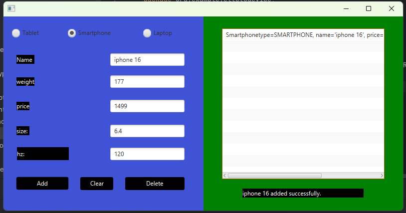
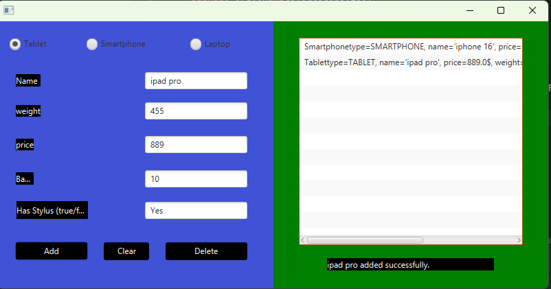
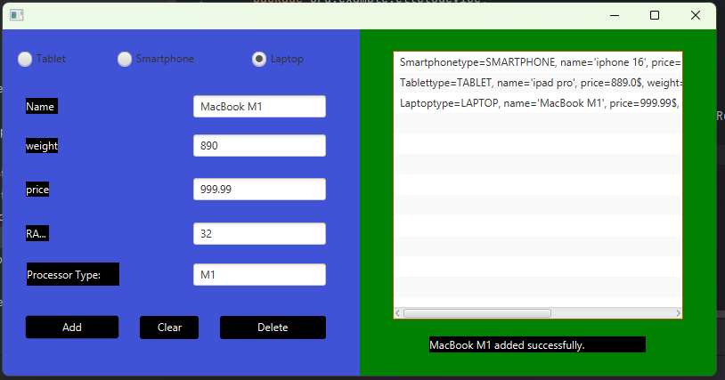
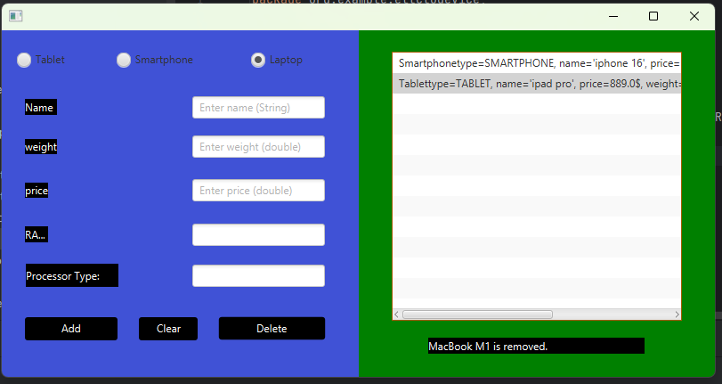

# README: JavaFX Device Manager

---

## **Project Description**
This project is a Java-based program designed to model and manage different types of devices using Object-Oriented Programming (OOP) principles. The program includes a base class `Device` and three derived classes (`Smartphone`, `Laptop`, `Tablet`) to represent specific device types. A user-friendly **JavaFX GUI** has been implemented to enable users to add, view, and manage devices interactively.

This project demonstrates inheritance, encapsulation, and GUI development using JavaFX. The primary goal is to provide a simple tool for managing devices and showcase clean OOP design principles.

---

## **Features**
1. **Device Modeling with OOP**:
   - A `Device` base class with common attributes (e.g., type, name, price, weight).
   - Derived classes for:
     - `Smartphone` with attributes: `screenSize`, `cameraResolution`.
     - `Laptop` with attributes: `ramSize`, `processorType`.
     - `Tablet` with attributes: `batteryLife`, `hasStylus`.

2. **JavaFX GUI**:
   - **Device Type Selection**: Tabs for selecting "Smartphone", "Laptop", or "Tablet".
   - **Input Fields**: Text fields for adding device-specific attributes.
   - **Add Button**: Adds a new device to the list.
   - **ListView**: Displays all devices in a dynamic list.
   - **Remove Button**: Removes the selected device from the list.

3. **Dynamic Updates**:
   - ObservableList for real-time updates to ListView.
   - Device selection and modification support.

---

## **Getting Started**

### **Prerequisites**
1. **Java Development Kit (JDK)**: Version 11 or higher.
2. **JavaFX SDK**: Download the JavaFX SDK and configure your IDE.
3. **IDE**: Use IntelliJ IDEA, Eclipse, or any Java IDE that supports JavaFX development.
4. **Git**: For cloning the repository.

---

---

# Usage Instructions
- **Smartphone**: 
- **Clear**: 
- **Tablet**: 
- **Laptop**: 
- **Delete**: 
---

# Sample Inputs
**Smartphone:**
- **Name: iPhone 14**
- **Price: 999.99**
- **Weight: 174.0**
- **Screen Size: 6.1**
- **Hertz: 120**

**Laptop:**
- **Name: Dell XPS 13**
- **Price: 1299.99**
- **Weight: 1200.0**
- **RAM Size: 16**
- **Processor Type: Intel i7**

**Tablet:**
- **Name: iPad Pro**
- **Price: 899.99**
- **Weight: 468.0**
- **Battery Life: 10.0**
- **Has Stylus: Yes**

